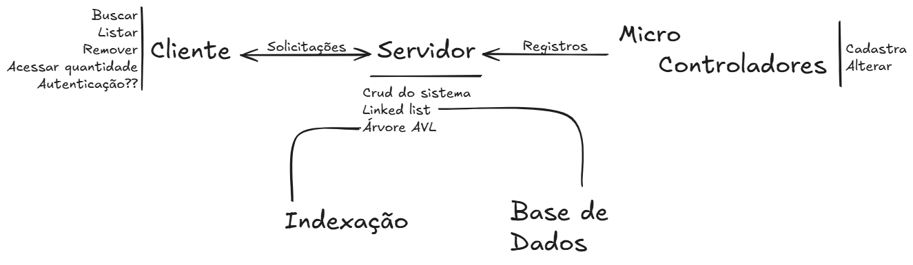

# Base de Dados de Monitoramento Ambiental
Projeto deenvolvido como parte da diciplina Estrutura de Dados 2, com o objetivo de similuar um 
SGBD. A aplicação utiliza uma árvore AVL como estrutura principal para indexação e busca dos registros, 
além de uma lista encadeada para guardar os dados.

# Funcionalidades
- **Cadastro de Registros**: Dados capturados por microcontroladores, como informações ambientais.
- **Busca de Registros**:
  - Por ID do registro. 
  - Por ID do dispositivo que gerou os dados.
- **Remoção de Registros**. 
- **Alteração de Registros**. 
- **Listagem Geral ou por Dispositivo**. 
- **Logs de Operações**:
  - Todas as operações de inserção, remoção e rotações da árvore são registradas em um arquivo de log. 
- **Interface via Terminal**: Usuário pode interagir com o sistema simulando um cliente ou um microcontrolador.

# Arquitetura 
- **Servidor**: Responsável por gerenciar o banco de dados e processar as requisições.
- **Proxy do Servidor**: Atua como intermediário, registrando logs e monitorando operações.
- **Clientes**:
  - **Microcontrolador (Simulado)**: Realiza inserções e alterações nos dados. 
  - **Cliente (Usuário)**: Realiza consultas e visualizações dos registros.

## Demonstrção do funcionamento

# Tecnologias
- Linguagem: Java
- Manipulação de arquivos para persistência de logs
- Gerenciamento de dados totalmente em memória, simulando um SGBD.

# Autor
**Lucas Silva de Souza**\
Curso: Ciência da Computação - UFERSA